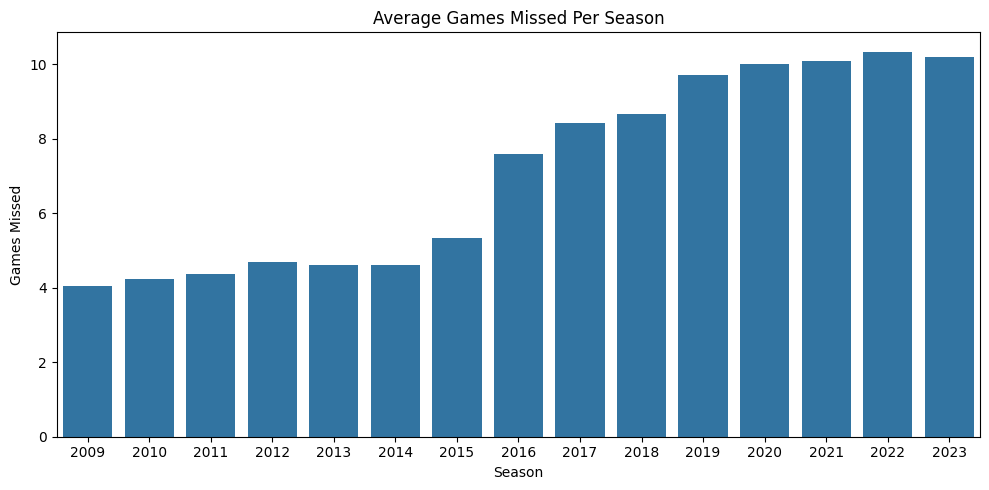
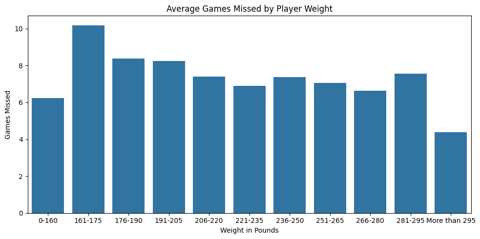
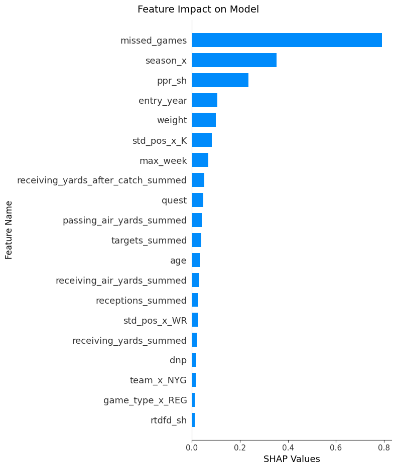

# NFL Missed Game Risk

## Table of Contents

1. [Introduction](#introduction)
2. [Data](#data)
3. [Process Outline](#process-outline)
   1. [Initial Observation/Clean](#clean-data)
   2. [Analyze Data](#analyze-data)
   3. [Preprocess Data for Model](#preprocess-data-for-model)
   4. [Model Analysis/Prediction](#model-prediction/analysis)
4. [Next Steps](#next-steps)
5. [References](#references)

## 1 - Introduction 

I started out wanting to create a model that will predict season scores for the upcoming fantasy football season.

According to an American Sports Data Inc. study, tackle football has the highest rate of injuries per 100 participants.

When I have attempted to create more simple models in the past for fantasy score predicitions, incorporating injury risk into the model proved to be the most difficult. Since NFL players are injured so frequently, accounting for this should help a score prediction model immensly

**Challenge** - Create a model that can usefully predict the liklihood a player misses four or more games in the upcoming NFL Season

## 2 - Data 

I used the nfl_data_py library, which is a python library connected to the NFLverse Github repository.

NFLverse scrapes weekly and seasonal data from the internet and consolidates into one respository. Weekly data is updated throughout the season and seasonal is at the end of each season.

The data goes back to 2009.

Datasets used are:

1. Weekly rosters
2. Weekly practice/injury reports
3. Seasonal scoring statistics

## 3 - Process Outline 

I will ultimately be making seasonal score predictions, so I will need my injury model to look at seasonal injuries.

Since some of the data is weekly, like practice injury reports, I need to consolidate those down to one season.

Lastly, each row in the data will consist of a player/season combination. For example, if I played 10 seasons in the NFL, my data will have 10 rows for me - one row for every season I played. If you played three seasons, my data would have three rows for you - one for every season you played.

I consulted with fantasy football experts on how many games missed starts to become a real hindrance on running a team for a season. In my discussion, we determined that missing four or more games is where the problems can start. Four games is more than 25% of a fantasy football season and represents missing a significant amount of time.

### 3i - Initial Observations/Clean 

The challenges I encountered when wrangling teh data were as follows:

1. Some data is weekly, need to consolidate down to seasonal

   a. Solution - took season long counts of pertinent weekly statistics for each player/season combo and consolidated down with those counts as features

2. Some of the datasets list the same player but with different names, player IDs, positions, or teams
   
   a. Solution - standardized player names, positions and seasons for correct merging and data integrity. Created my own unique ID that could be used to join all sets together regardless of formet

3. Some datasets had NAs for birthday, draft year, weight, etc -- all missing not at random

   a. Solution - Some of the information like birthday was included in some seasons but not others. I was able to fill these NaNs by using the information where it was present in other seasons
   b. In the rare instances where the information wasn't available anywhere in the data, I turned to the internet to determine their weight, draft year, etc

### 3ii - Analyze Data 

#### Number of player/season combinations that missed four or more games in dataset - 50%

Half of the player/season combinations showed that they missed four or more games in that particular season. Though football has a higher injury rate, this number was higher than I anticipated.

*With that said, as a baseline, my model needs to at least have an accuracy greater than 50% for me to consider it a success.*

#### Interesting Findings

**Season Played/Missed Games**

The chart above shows that time missed has increased over time, starting with the 2015 season.

I found this fascinating as I would have guessed that games missed would have *decreased* as time passed. The assumption was that technology and medicine improve regularly over time, therefore games missed owuld decrease.

This warrants further exploration as I improve the model over time.

**Weight/Missed Games**

The chart above shows that average games missed *increases* the lighter a player is.

I also found this interesting as I have anecdotally assumed larger players were more injury prone. The thinking goes that larger bodies put more stress on joints and body parts and wear down faster than a lighter body would.

After analysis, though, it makes perfect sense that lighter players get injured for longer periods of time. In a violent sport like football, if two players with a 100 pound weight difference collide, I would guess the lighter player would feel the impact more than the heavier player.

### 3iii - Preprocess Data for Model 

Most of the model preprocessing was done in data wrangling and cleaning. Once I had everything wrangled, I only needed to properly create my target column.

I created this by making a column with a 1 for players who missed four or more games in that season and a 0 if they missed less than four. I sorted the data by player and season with the most recent season at the top of each player group.

Then, I shifted my target column down one row. This made it so every players' missed games target was the number of games missed in the following season.

This process prevented data leakage and allowed me to cleanly create my own target.

My train set consisted of all seasons 2022 and before. My test set consisted of the 2023 season. This made it so my test set was predictions for the most recent season, 2024, and my train set was everything before that.

The thinking here is that to make predictions for the upcoming season, I will only have data for the seasons preceding it.

### 3iv - Model Analysis/Prediction 

I trained and tested the following models:

1. Logistic Regression
2. Decisition Tree untuned
3. Random Forest Untuned
4. Random Forest tuned with GridSearch
5. XG Boost untuned
6. XG Boost tuned with Gridsearch

**Best Model** - XG Boost untuned - 74% test set accuracy

In looking at the confusion matrix, the following stuck out to me:

1. 83% of players who *missed* four or more games were accurately identified
2. 43% of players who *did not miss* four or more games were innacurately identified

All of these numbers are better than yardstick of 50%. I am especially pleased with the 83% number above. I would much prefer the model accurately identifies those who miss four or more gaems as these are the players that could really throw a wrench in a season.

While 43% is a little better than the baseline for players who did not miss four or more, I would like to improve this number so I don't end up underweighting players who make it through the full season.

On balance, I feel the model is able to be used in its current state. They ways I would like to improve upon it are covered in next steps below.

**Feature Importance**

In determining which features the best model thought were the most relevant for predictions, there were no surprises.

Coming in on top, the number of games missed in the current season looks to be the most important in determining how many games are missed next season. The entire idea of this project was to determine if there were players who were more injury prone than others. This statistic shows that getting injured now means a player is more likely to get injured later.

## 4 - Next Steps 

1. Additional Features?

   a. There were more datasets available in NFLverse that I could incorporate into this model that may or may not have an effect. I would like to try this in addition to feature engineering to see if performance improves

2. Rookies?

   a. Since rookie players are in their first year, they are removed from the predictions. I would like to spend some time analyzing rookie only data to see if there's a way to work them in as well

3. Tune prediciton threshold

   a. I would like to tune my decision threshold to see if I can improve performance
   b. This would be especially for improving the 43% inforrect predictions for players that didn't miss four games or more

4. Use this fine-tuned prediction as a feature in a season-long scoring model

## References 

https://pypi.org/project/nfl-data-py/
